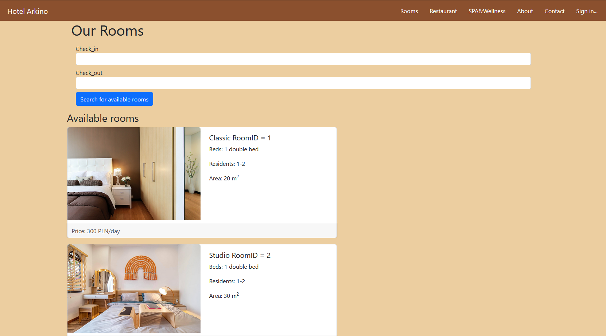

# Hotel-Arkino-API
•	Rooms – podstrona w której można zapoznać się z ofertą noclegową hotelu. Znajdują się tutaj rodzaje pokoi wraz najistotniejszymi informacjami,

•	Restaurant – podstrona z ofertą hotelowej restauracji, 

•	SPA&Wellness – przejście do podstrony w której można zapoznać się z ofertą odnowy biologicznej i rekreacji,  

•	About – podstrona opisująca historię, początki oraz najważniejsze wydarzenia odbywające się w hotelu, 

•	Offer – podstrona przechowująca zapytania o rezerwację, widoczna tylko dla zalogowanego administratora strony,

•	My Reservations – podstrona przechowująca wszystkie rezerwacje, widoczna tylko dla zalogowanych użytkowników,

•	Contact – przesuwające widok na dolną część strony gdzie znajdują się dane kontaktowe.

  

### W podstronie Rooms znajduje się możliwość zarezerwowania pokoju dla zarejestrowanych użytkowników.

## Tabela routingu

## Diagram ERD bazy danych

## Opis tabel:
Tabele Personal_access_tokens, Password_resets, Failed_jobs oraz Migrations zostały wygenerowane automatycznie przez framework Laravel.
Tabela Rooms przechowuje ona podstawowe dane dotyczące pokoi jakie jak typ pokoju, ilość osób możliwa do przydzielenia, rodzaj łóżka, powierzchnię oraz cenę za jedną dobę hotelową.
Tabela Roomtypes przechowuje dane dotyczące rodzajów pokoi. Jego typ, ilość osób możliwa do przydzielenia, rodzaj łóżek, opis, cenę, oraz posiada klucz obcy z tabeli Rooms który przypisuje każdy rodzaj pokoju do poszczególnych pokoi.
Tabela Reservations zawiera email użytkownika na który dokonana jest rezerwacja pokoju, numer identyfikacyjny pokoju oraz daty zameldowania i wymeldowania z hotelu.
Tabela Offers przechowuje zapytania o rezerwacje od niezalogowanych użytkowników. Przechowuje ona informacje emailu osoby która chce dokonać rezerwacji, typ pokoju, deklaracje ilości gości, daty zameldowania i wymeldowania oraz komentarz dotyczący zapytania.
